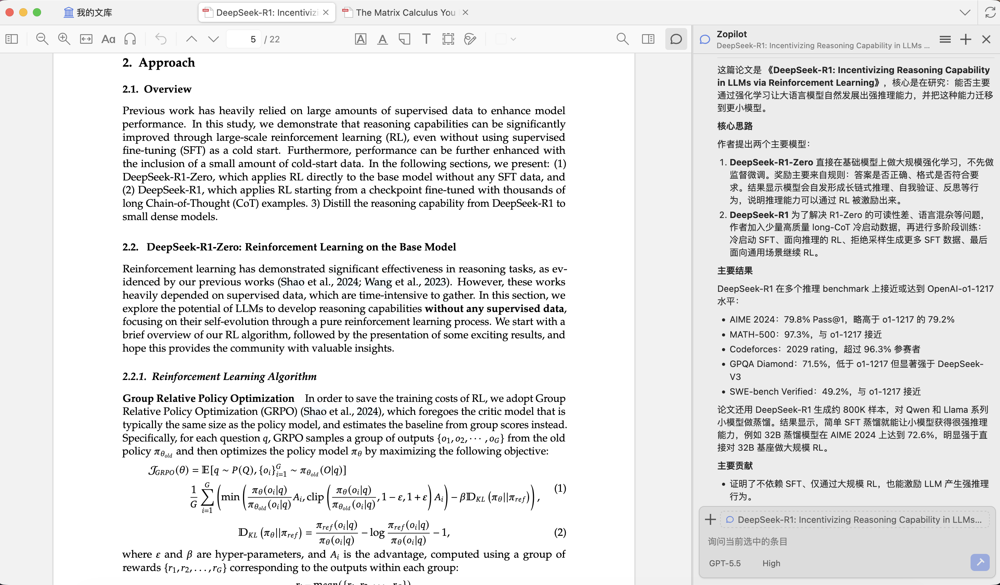
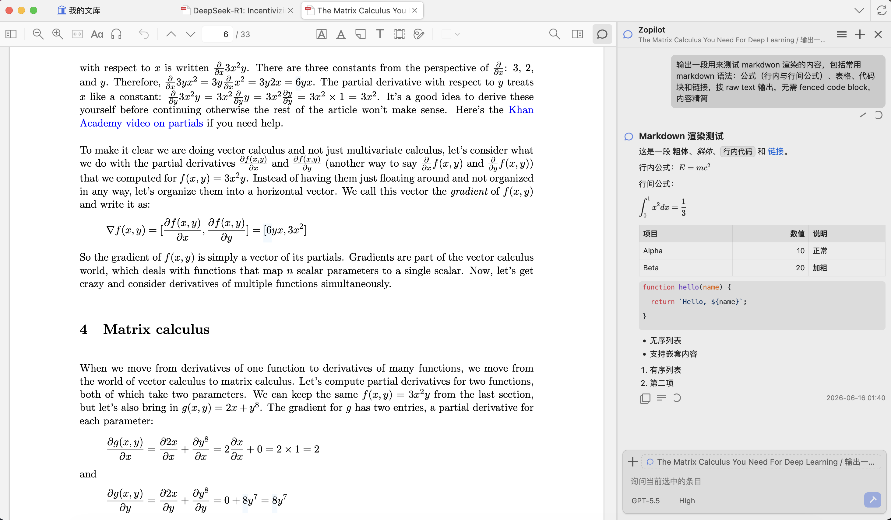

# Zopilot

Zopilot is an information-dense AI research sidebar for Zotero.

## Requirements

- MacOS
- Zotero 9.0.x
- Either Codex CLI or a supported OpenAI-compatible BYOK provider profile

## Preview

<!-- 

 -->

## Feature

- Native agent integration in Zotero, with Codex CLI as an optional backend.
- BYOK profiles for hosted OpenAI-compatible providers such as DeepSeek, Z.AI/GLM, and MiniMax.
- Workspace-scoped chats for libraries, collections, and papers.
- Persistent session history across Zotero workspaces.
- PDF and image attachments for richer research context.
- Paper-aware retrieval with page-level evidence.
- Custom prompt templates from the sidebar.

<!-- ## Gratitude

Thanks to the following projects that make Zopilot possible:

- [zotero-plugin-template](https://github.com/windingwind/zotero-plugin-template): An awesome plugin template for Zotero.
- [llm-for-zotero](https://github.com/yilewang/llm-for-zotero): Inspired the creation of this plugin.
- [markdown-it](https://github.com/markdown-it/markdown-it): The Markdown parser used to render Codex responses.
- [mdit-plugins](https://github.com/mdit-plugins/mdit-plugins): Markdown-it extensions used for task lists, footnotes, and TeX blocks.
- [Shiki](https://github.com/shikijs/shiki): Syntax highlighting for code blocks in Codex responses. -->
