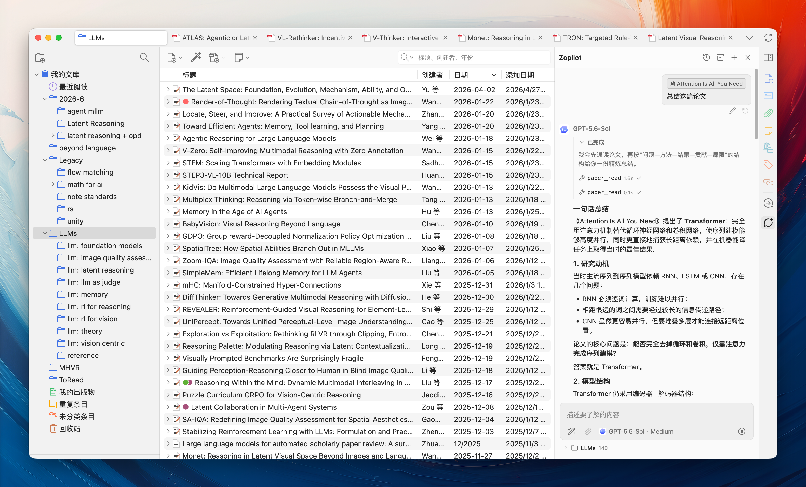
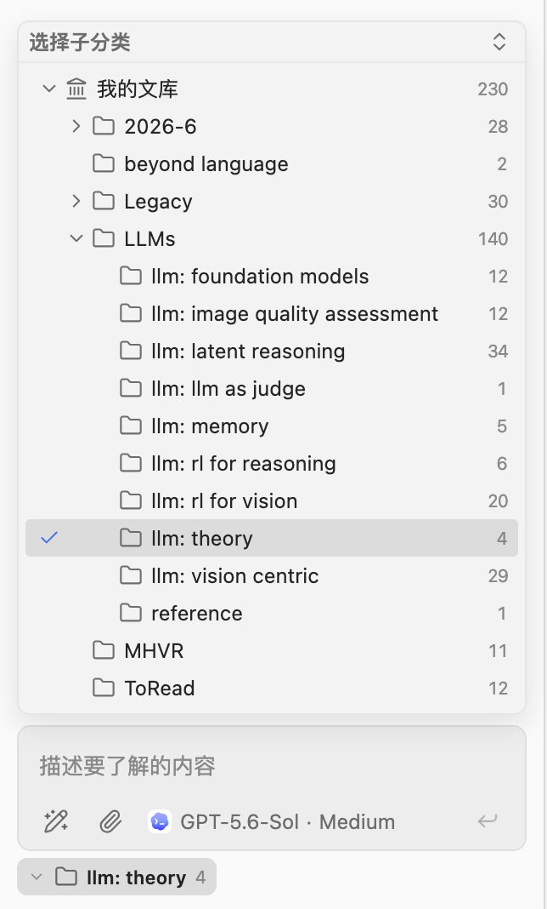
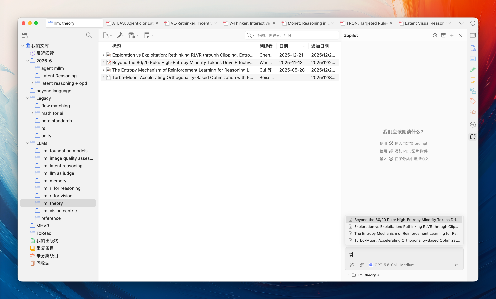
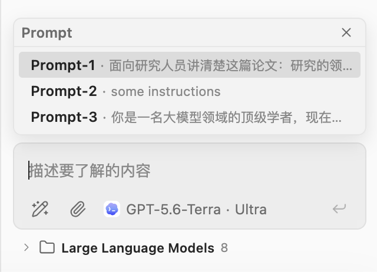
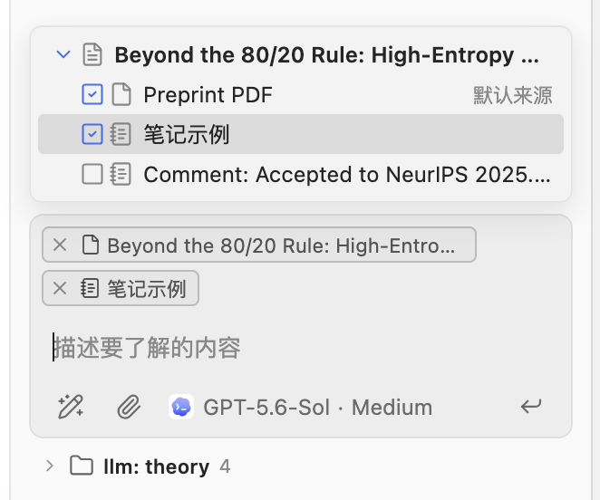
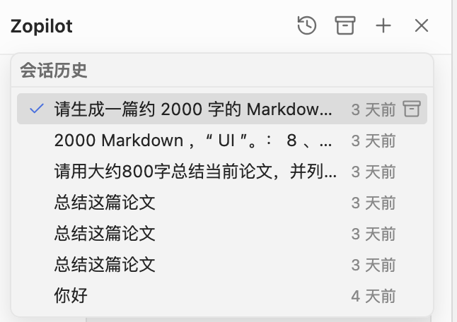
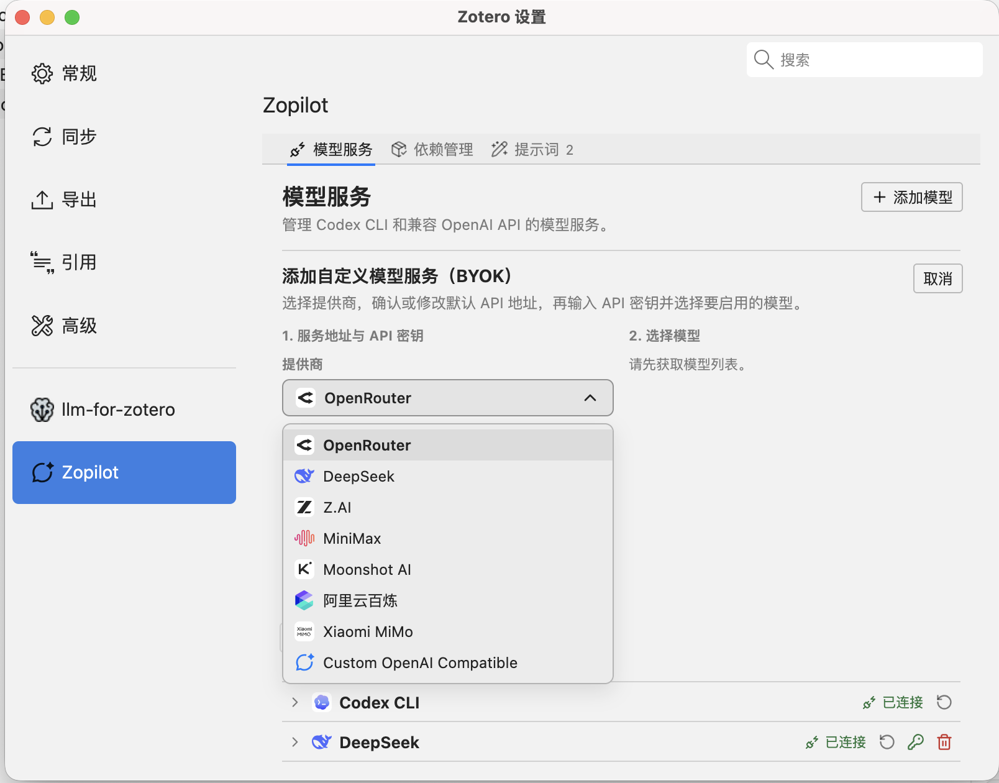

# Zopilot

[English](./docs/README_EN.md) · **简体中文**

Zopilot 是一款简约、现代化的 Zotero AI 插件, 将 AI 接入 Zotero 侧边栏中，作为你的论文阅读助手。

## 特点

- VS Code Copilot 风格的紧凑、高信息密度 UI 设计
- 支持 BYOK 模型 (OpenAI 兼容的 API) 和 Codex 订阅 (需要安装 Codex CLI)

## 环境要求

- Zotero 9.0
- macOS 或 Windows x86_64

## 开始使用

- 安装 zopilot: Zotero -> 工具 -> 插件 -> 拖入 `xpi` 文件
- 配置 PDF 解析依赖: Zotero -> 设置 -> Zopilot -> 依赖管理 -> 安装
- 配置 Provider: Zotero -> 设置 -> Zopilot -> Provider -> 填入 URL 和 API key (默认支持 codex cli，无需配置即可直接使用)

## 预览

**主页面**

**选择子分类**

**使用 @ 选择论文**

**插入自定义 prompt**

**点击论文胶囊将更多附件（如笔记）添加到上下文**

**会话历史**

**配置自定义 API**

## 已知问题

- 附件功能（插入外部PDF/图片到对话中）当前仅对 Codex CLI 有效
- 文档解析功能依赖 [pymupdf4llm](https://github.com/pymupdf/pymupdf)，处理超长文档 (>100页) 时速度较慢，可能遇到回答超时、 UI 阻塞问题

## 反馈

- 欢迎提 Issue 反馈在使用过程中遇到的问题，或联系 `qyang@bupt.edu.cn`

## 其他

- [llm-for-zotero](https://github.com/yilewang/llm-for-zotero): 另一款 Zotero AI 插件，具有更丰富的 Agent 功能。
