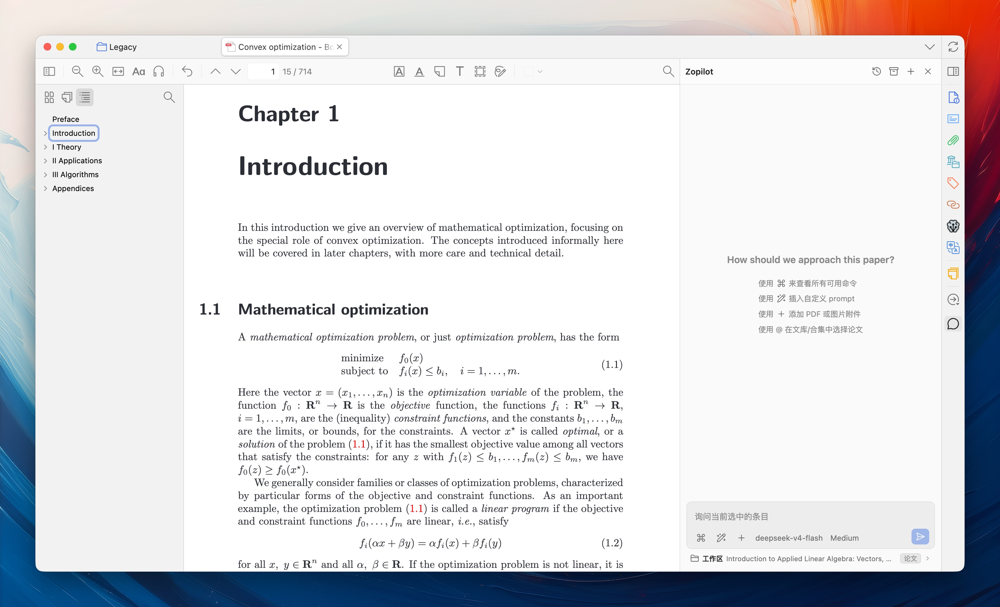
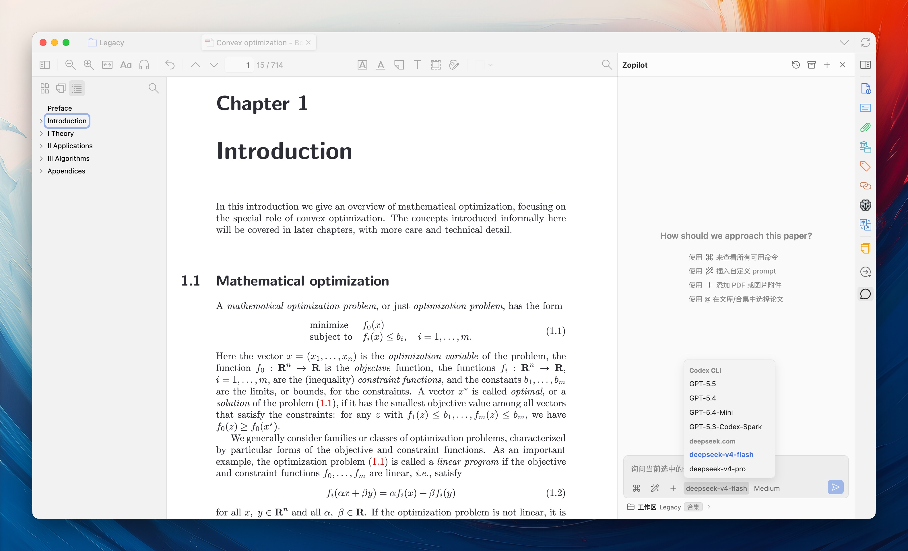

# Zopilot

**English** · [简体中文](../README.md)

Zopilot is a Zotero plugin that brings AI into the Zopilot sidebar as your paper-reading assistant.

## Highlights

- Standalone sidebar window
- Minimal, information-dense UI design
- Supports BYOK and Codex CLI

## Requirements

- macOS Apple Silicon (arm64), macOS Intel (x64), or Windows x64
- Windows ARM64 is not supported
- Zotero 9.0.x

## Getting Started

- Install Zopilot: Zotero -> Tools -> Plugins -> drag in the `xpi` file
- Configure PDF parsing dependencies: Zotero -> Settings -> Zopilot -> Dependency Management -> Install
- Configure a provider: Zotero -> Settings -> Zopilot -> Provider -> enter the URL and API key. Codex CLI is supported by default and can be used without additional configuration.

## Preview

**Main Page**

**Workspace Selection**

**Use @ to Mention Multiple Papers**

**Select Model**

**Insert a Custom Prompt**

## Features

- Native Zotero workspace support, allowing you to ask questions about papers in a library or collection
- Supports Codex CLI with a Codex subscription and BYOK with OpenAI-compatible APIs
- Supports attachment uploads, including local PDFs and images
- Supports saved session history
- Supports custom prompt configuration

## Feedback

- Please open an issue for any problems you encounter, or contact `qyang@bupt.edu.cn`.

<!-- ## Gratitude

Thanks to the following projects that make Zopilot possible:

- [zotero-plugin-template](https://github.com/windingwind/zotero-plugin-template): An awesome plugin template for Zotero.
- [llm-for-zotero](https://github.com/yilewang/llm-for-zotero): Inspired the creation of this plugin.
- [markdown-it](https://github.com/markdown-it/markdown-it): The Markdown parser used to render Codex responses.
- [mdit-plugins](https://github.com/mdit-plugins/mdit-plugins): Markdown-it extensions used for task lists, footnotes, and TeX blocks.
- [Shiki](https://github.com/shikijs/shiki): Syntax highlighting for code blocks in Codex responses. -->
